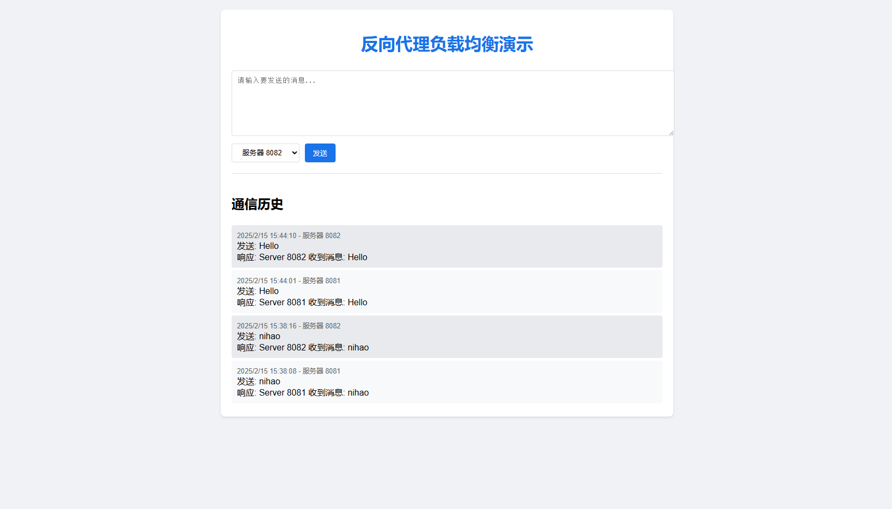

# 反向代理负载均衡演示项目

这是一个简单的反向代理负载均衡演示项目，包含前端页面和后端服务。

具体博客文章见[深入浅出反向代理：从原理应用到代码示例](https://soda.dnggentle.art/%E7%B3%BB%E7%BB%9F%E8%AE%BE%E8%AE%A1/%E6%B7%B1%E5%85%A5%E6%B5%85%E5%87%BA%E5%8F%8D%E5%90%91%E4%BB%A3%E7%90%86%E4%BB%8E%E5%8E%9F%E7%90%86%E5%BA%94%E7%94%A8%E5%88%B0%E4%BB%A3%E7%A0%81%E7%A4%BA%E4%BE%8B/)




## 项目结构
```
/reverse-proxy-demo
├── static/
│   ├── index.html     # 前端页面
│   ├── styles.css     # 样式文件
│   └── script.js      # 前端逻辑
├── backend/
│   ├── server1/       # 后端服务器1
│   │   └── main.go    # 8081端口服务
│   └── server2/       # 后端服务器2
│       └── main.go    # 8082端口服务
├── proxy/
│   └── main.go        # 反向代理服务器
├── go.mod
└── go.sum
```

## 功能特点

1. 前端页面允许用户：
   - 输入要发送的消息
   - 选择目标后端服务器（8081或8082）
   - 查看通信历史记录

2. 后端服务：
   - 两个独立的后端服务器（端口8081和8082）
   - 每个服务器都会处理请求并返回带有服务器标识的响应

3. 反向代理：
   - 监听3000端口
   - 根据请求路径转发到对应的后端服务
   - 提供静态文件服务

## 运行说明

1. 启动后端服务器：
```bash
go run backend/server1/main.go
go run backend/server2/main.go
```

2. 启动反向代理：
```bash
go run proxy/main.go
```

3. 访问应用：
打开浏览器访问 http://localhost:3000

## 技术栈

- 前端：HTML, CSS, JavaScript
- 后端：Go
- 代理：Go (使用 net/http 包)


```
前端 (3000端口)
    ↓ POST /api/server8081
代理服务器 (3000端口)
    ↓ 转发到 http://localhost:8081
后端服务器1 (8081端口)
    ↓ 处理请求
    ↑ 返回响应
代理服务器
    ↑ 转发响应
前端
    ↑ 显示结果
```